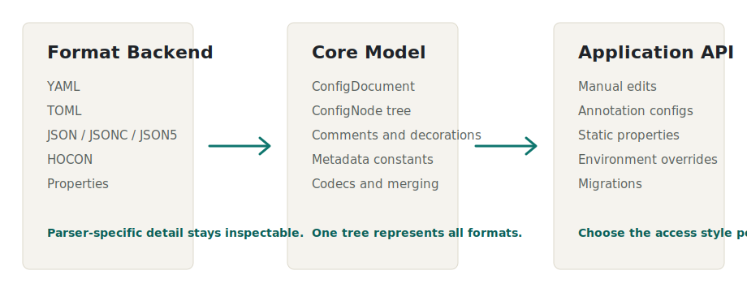

# PistonConfig

PistonConfig is a Java 25 configuration library for projects that need one document model across YAML, TOML, HOCON, JSON, JSONC, JSON5, and `.properties`.

{: .lead }
Load a human-edited file, preserve comments and source detail where the backend exposes it, merge defaults, apply overrides, run migrations, and read values through the access style that fits your project.

<div class="quickstart" markdown="1">
  <div markdown="1">

## Install

```kotlin
dependencies {
  implementation(platform("net.pistonmaster:pistonconfig-bom:0.1.0-SNAPSHOT"))
  implementation("net.pistonmaster:pistonconfig-core")
  implementation("net.pistonmaster:pistonconfig-yaml")
}
```

  </div>
  <div markdown="1">

## Load and Save

```java
var path = Path.of("config.yml");
var loader = YamlConfigFormat.INSTANCE.loader();
var document = ConfigLoaders.load(path, loader);

document.mergeDefaults(defaults, MergeOptions.conservative());
ConfigLoaders.save(path, loader, document);
```

  </div>
</div>

## Start With the Job You Have

<div class="path-grid">
  <a class="link-card" href="tools/module-builder.html">
    <h3>Choose modules</h3>
    <p>Select backends and access modules, then generate Gradle or Maven snippets.</p>
  </a>
  <a class="link-card" href="guides/getting-started.html">
    <h3>Set up a config file</h3>
    <p>Build defaults, load a user file, merge missing values, apply overrides, and save the result.</p>
  </a>
  <a class="link-card" href="guides/format-backends.html">
    <h3>Choose a format backend</h3>
    <p>Compare YAML, TOML, HOCON, JSON, JSONC, JSON5, and properties behavior.</p>
  </a>
  <a class="link-card" href="guides/annotation-configs.html">
    <h3>Map object configs</h3>
    <p>Use annotated Java classes for defaults, comments, names, and path prefixes.</p>
  </a>
  <a class="link-card" href="guides/static-field-configs.html">
    <h3>Centralize typed keys</h3>
    <p>Declare ConfigMe-style static properties with defaults, comments, and typed reads.</p>
  </a>
  <a class="link-card" href="examples/application-startup.html">
    <h3>Copy a startup flow</h3>
    <p>Use a complete load, migrate, merge, override, validate, read, and save example.</p>
  </a>
</div>

## How the Pieces Fit

<div class="diagram">
  
</div>

## Main Capabilities

<div class="home-grid">
  <section class="home-panel">
    <h2>Lossless Core</h2>
    <p>Objects, lists, scalars, nulls, comments, key decorations, source locations, scalar style, collection style, and backend metadata.</p>
  </section>
  <section class="home-panel">
    <h2>Established Backends</h2>
    <p>SnakeYAML, Apache Commons Configuration, json5-java, Night Config, and Lightbend Config do the parser-specific work.</p>
  </section>
  <section class="home-panel">
    <h2>Typed Access</h2>
    <p>Use built-in scalar codecs, custom codecs, annotations, static fields, or direct document edits from the same model.</p>
  </section>
  <section class="home-panel">
    <h2>Operational Tools</h2>
    <p>Merge defaults, apply environment and system property overrides, and run ordered schema migrations.</p>
  </section>
</div>

## Documentation Map

<div class="doc-grid three">
  <a class="link-card" href="guides/">
    <h3>Guides</h3>
    <p>Task-focused docs for installation, backends, merging, codecs, testing, and diagnostics.</p>
  </a>
  <a class="link-card" href="examples/">
    <h3>Examples</h3>
    <p>Complete startup, conversion, record codec, and static key registry examples.</p>
  </a>
  <a class="link-card" href="reference/">
    <h3>Reference</h3>
    <p>Modules, API surface, format comparison, metadata, startup order, and publishing.</p>
  </a>
  <a class="link-card" href="concepts/">
    <h3>Concepts</h3>
    <p>Design goals, access styles, round-tripping, migrations, and type safety.</p>
  </a>
  <a class="link-card" href="tools/">
    <h3>Tools</h3>
    <p>Client-side helpers for choosing modules and building dependency snippets.</p>
  </a>
  <a class="link-card" href="guides/installation.html">
    <h3>Installation</h3>
    <p>Gradle, Maven, BOM usage, Maven Central, and GitHub Packages.</p>
  </a>
</div>

## Reference Shortcuts

| Need | Page |
| --- | --- |
| Compare all modules | [Modules](reference/modules.html) |
| Inspect public types | [API Surface](reference/api-surface.html) |
| Compare format behavior | [Format Comparison](reference/format-comparison.html) |
| Understand metadata constants | [Format Metadata](reference/format-metadata.html) |
| Pick the correct startup sequence | [Startup Order](reference/startup-order.html) |

<p class="page-footer">PistonConfig targets Java 25 and publishes sources and Javadocs jars for library modules.</p>
